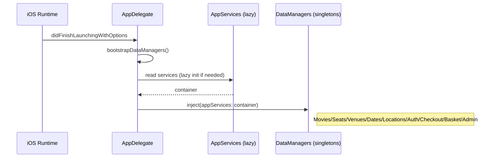
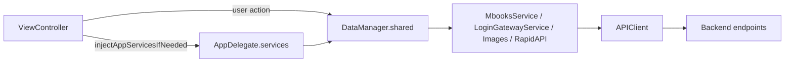

# AppServices Injection and DataManagers Big Picture

## Why this exists
`AppServices` is the app-wide dependency container for backend access (`APIClient`, `MbooksService`, `LoginGatewayService`, `ImageResourceService`, `RapidMovieDatabaseService`).

`HasAppServices` is the protocol that gives classes an `appServices` property, and the extension method below is the shared setter:

```swift
extension HasAppServices {
    func inject(appServices: AppServices) {
        self.appServices = appServices
    }
}
```

## Your exact question: how and when is `inject(appServices:)` used?

### What it does
- It is a thin helper method that sets `self.appServices`.
- It is used as manual dependency injection for classes conforming to `HasAppServices`.

### When it runs
1. App starts.
2. `AppDelegate.application(_:didFinishLaunchingWithOptions:)` calls `bootstrapDataManagers()`.
3. `bootstrapDataManagers()` calls `.inject(appServices: container)` for each DataManager singleton.

Source:
- `SwiftCinemas/SwiftLoginScreen/AppDelegate.swift` (`didFinishLaunchingWithOptions`, `bootstrapDataManagers`)
- `SwiftCinemas/SwiftLoginScreen/Networking/BackendServices.swift` (`inject(appServices:)`)

### Concrete call sites (DataManager bootstrap)
`AppDelegate.bootstrapDataManagers()` injects into:
- `MoviesDataManager.shared`
- `SeatsDataManager.shared`
- `VenuesDataManager.shared`
- `DatesDataManager.shared`
- `LocationsDataManager.shared`
- `AuthDataManager.shared`
- `CheckoutDataManager.shared`
- `BasketDataManager.shared`
- `AdminDataManager.shared`

## How `injectAppServicesIfNeeded()` differs

`inject(appServices:)` and `injectAppServicesIfNeeded()` serve different contexts:

- `inject(appServices:)`
  - explicit/manual
  - used mainly by `AppDelegate` during startup
  - usually DataManagers

- `injectAppServicesIfNeeded()`
  - lazy fallback for `UIViewController`
  - pulls from `(UIApplication.shared.delegate as? AppDelegate)?.services`
  - called in VC lifecycle methods (`viewDidLoad`, etc.)

## Startup flow diagram



## Runtime usage flow (VC + DataManager)



## Big picture architecture

```mermaid
flowchart TD
    subgraph App Layer
      AD[AppDelegate]
      VC[ViewControllers]
    end

    subgraph Dependency Container
      AS[AppServices]
      API[APIClient]
      MB[MbooksService]
      LG[LoginGatewayService]
      IM[ImageResourceService]
      RM[RapidMovieDatabaseService]
    end

    subgraph State and Use Cases
      DM1[MoviesDataManager]
      DM2[VenuesDataManager]
      DM3[DatesDataManager]
      DM4[SeatsDataManager]
      DM5[LocationsDataManager]
      DM6[AuthDataManager]
      DM7[CheckoutDataManager]
      DM8[BasketDataManager]
      DM9[AdminDataManager]
    end

    AD -->|creates lazy| AS
    AD -->|bootstrap inject| DM1
    AD -->|bootstrap inject| DM2
    AD -->|bootstrap inject| DM3
    AD -->|bootstrap inject| DM4
    AD -->|bootstrap inject| DM5
    AD -->|bootstrap inject| DM6
    AD -->|bootstrap inject| DM7
    AD -->|bootstrap inject| DM8
    AD -->|bootstrap inject| DM9

    VC -->|lazy inject fallback| AS
    VC -->|calls| DM1
    VC -->|calls| DM2
    VC -->|calls| DM3
    VC -->|calls| DM4
    VC -->|calls| DM5
    VC -->|calls| DM6
    VC -->|calls| DM7
    VC -->|calls| DM8
    VC -->|calls| DM9

    AS --> API
    AS --> MB
    AS --> LG
    AS --> IM
    AS --> RM

    DM1 --> MB
    DM1 --> IM
    DM1 --> RM
    DM2 --> MB
    DM3 --> MB
    DM4 --> MB
    DM5 --> MB
    DM6 --> API
    DM6 --> LG
    DM7 --> LG
    DM8 --> LG
    DM9 --> MB
```



## Coupling with DataManagers (current state)

DataManagers are singleton + injected-service style:
- each manager conforms to `HasAppServices`
- each manager stores `var appServices: AppServices!`
- each manager exposes typed computed dependencies (for example `private var mbooks: MbooksService { appServices.mbooks }`)

This means:
- network entry points are mostly centralized in DataManagers
- shared state/context is manager-owned (`selectedMovie`, selected seats, selected purchase, etc.)
- ViewControllers can still use `appServices` directly in some places (mostly image fetches), so migration is mostly complete but not 100% strict

## Current direct VC usages of `appServices` (important for migration cleanup)
There are still direct ViewController calls like:
- `appServices.images.getData(...)` in several VCs (`MoviesVC`, `VenuesVC`, `VenuesDetailsVC`, `TicketsVC`, `BasketVC`, `MenuVC`, `VenueForMoviesVC`, `PurchasesVC`)

These are valid today, but if you want stricter layering, move them behind DataManagers.

## Practical takeaway
- `inject(appServices:)` is primarily a startup wiring hook used by `AppDelegate`.
- `injectAppServicesIfNeeded()` is a VC safety net for lazy pull from `AppDelegate.services`.
- DataManagers are the main abstraction over backend services; VCs should prefer DataManagers over direct service usage.

